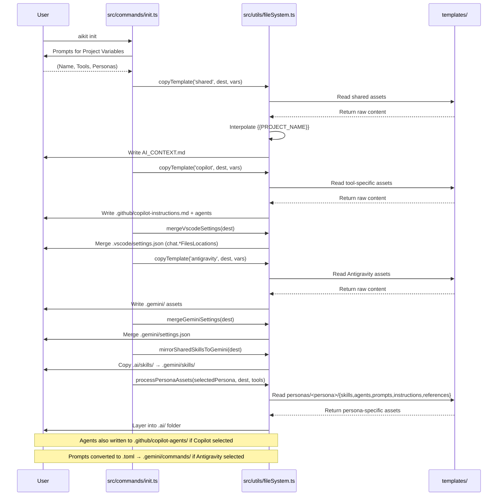

# Principal-Level Guide

Welcome to the AI Scaffold CLI architecture guide. This section is designed for senior engineers evaluating the core design implementation.

## Core Architectural Insight: Dynamic Template Evaluation
Unlike heavier CLI generators (like `create-react-app` or `Plop`) which rely on heavy AST parsing, this specific tool treats text-based generation exclusively via **mid-flight string interpolation and recursive buffering.**

In TypeScript: We iterate over template files with `fs.readFile`, regex substitute `{{VAR}}` to target variables, and execute an `fs.writeFile` to the destination. 

### Cross-Language Comparison
If implemented in Python, we would likely leverage a mature text-processor like **Jinja2** combined with `Pathlib` or cookiecutter logic:
```python
# Pseudo-Python Jinja2 Example
from jinja2 import Template
from pathlib import Path

def process_file(src_path: Path, dest_path: Path, context: dict):
    template_content = src_path.read_text()
    rendered = Template(template_content).render(**context)
    dest_path.write_text(rendered)
```
The trade-off here is relying strictly on lightweight native string regex matching `varName.replace(...)` to reduce dependency bloat, meaning no external template engine is required for the `.md` transformations!

## Architecture Flow

