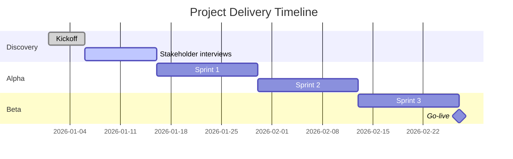
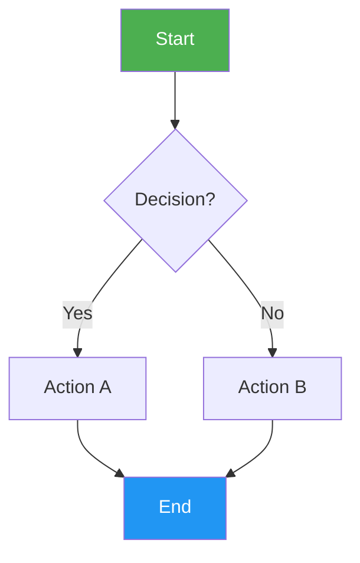
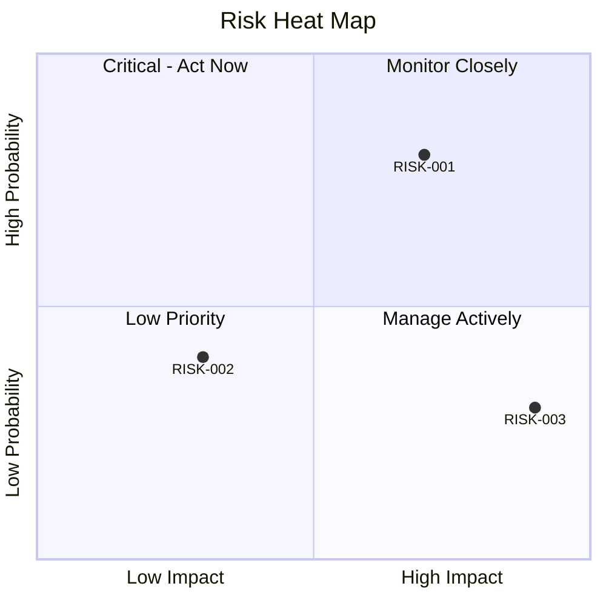
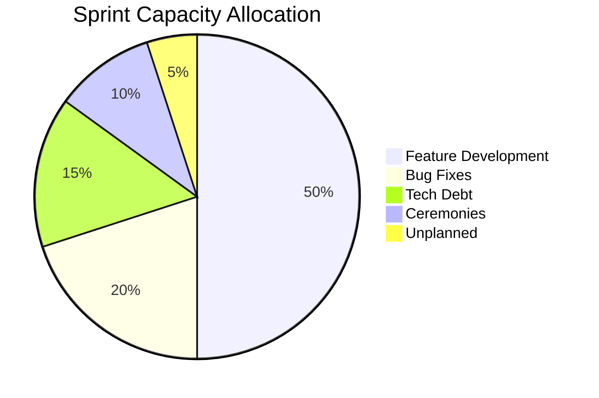
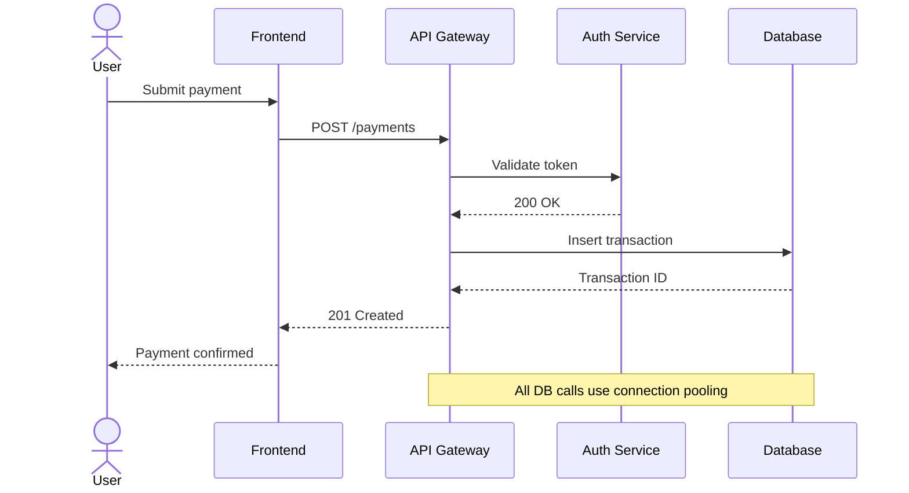
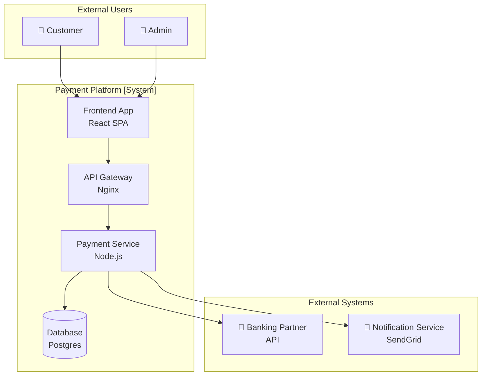
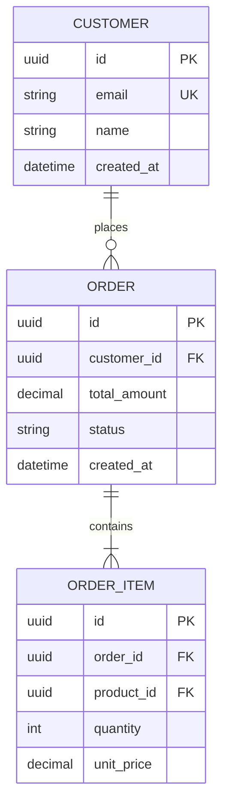

# Mermaid Syntax Skill for AIKit

This skill provides Mermaid diagram syntax reference for delivery and architecture diagrams. Load this skill when generating Mermaid diagrams in AIKit artifacts.

## Diagram Types Used in AIKit

### Gantt Chart (delivery timelines, sprint plans, roadmaps)

**Key syntax**:
- `done` = completed task
- `active` = current task
- `crit` = critical path
- `milestone` = milestone (0d duration)
- `after {id}` = dependency

---

### Flowchart (workflows, escalation paths, decision trees)

**Node shapes**:
- `[Rectangle]` — process/step
- `{Diamond}` — decision
- `(Rounded)` — start/end
- `[(Database)]` — storage
- `[/Parallelogram/]` — input/output
- `((Circle))` — connector

**Direction**: `TD` (top-down), `LR` (left-right), `BT` (bottom-top), `RL` (right-left)

---

### Quadrant Chart (risk maps, stakeholder grids, prioritisation)

**Use for**: Risk heat maps (probability vs impact), Stakeholder maps (influence vs interest), Prioritisation matrices

---

### Pie Chart (effort distribution, category breakdowns)

---

### Sequence Diagram (API flows, incident timelines, process flows)

**Key syntax**:
- `->>` solid arrow (sync call)
- `-->>` dashed arrow (response)
- `actor` for human actors
- `Note over A,B:` for annotations

---

### C4 Context Diagram (system boundaries — using flowchart subgraphs)

---

### Entity Relationship Diagram (data models)

**Relationship notation**:
- `||--||` one-to-one
- `||--o{` one-to-many (optional)
- `||--|{` one-to-many (mandatory)
- `}o--o{` many-to-many (optional)

---

## Common AIKit Diagram Patterns

### Risk Heat Map
Use quadrant chart with RISK-{NNN} items positioned by [impact, probability].

### Stakeholder Map
Use quadrant chart with stakeholder names positioned by [interest, influence].

### Delivery Timeline
Use Gantt with phases as sections and milestones at key gates.

### Escalation Path
Use flowchart TD with decision diamonds for escalation criteria.

### Sprint Burndown Context
Use Gantt or describe as table — Mermaid has no native burndown chart.

### Architecture
Use flowchart with subgraphs for system boundaries (C4 style).

## Tips

- Always add a `title` to charts
- Use `style` to color-code critical items (red = critical, amber = warning, green = good)
- Keep diagrams focused — one concept per diagram
- Add diagram after the narrative section that explains it
- Use `%%` for comments inside diagrams
